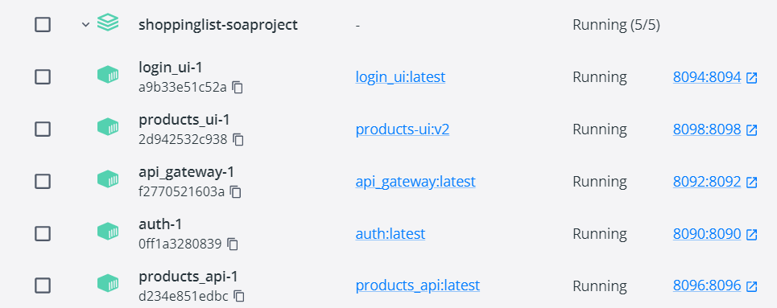
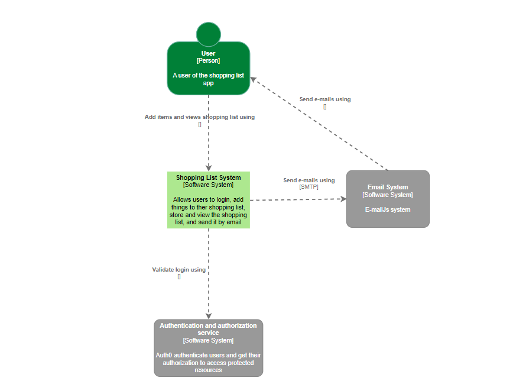
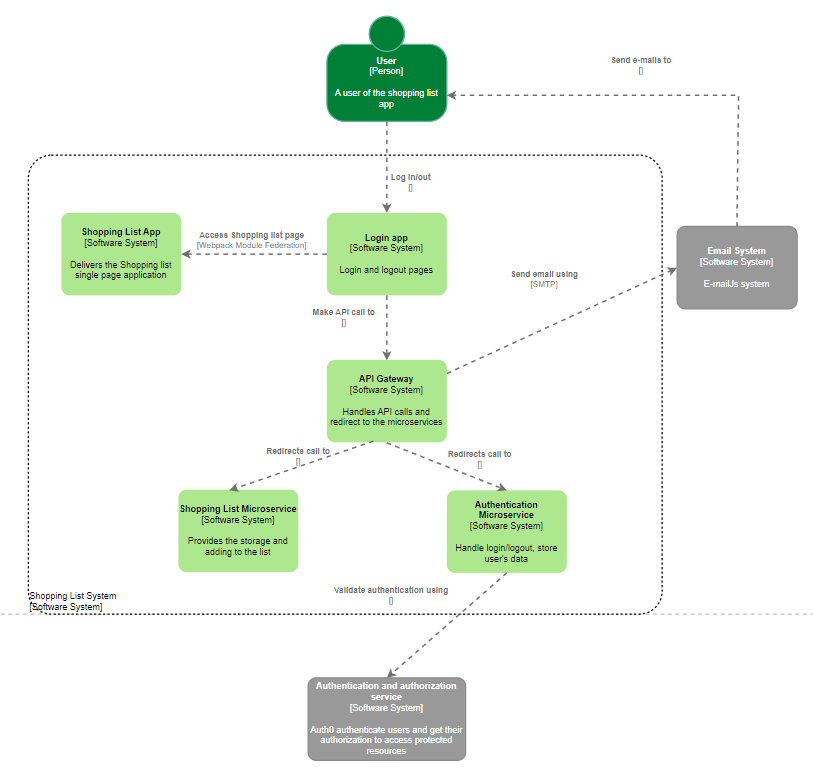

<h1 align="center">Shopping List App</h1>
<h3 align="center">SOA Project</h3>

## About the application
The Shopping List App is an application that allows users to create a list of items they need to purchase at a store. The app allows users to add items to their list by typing them in manually, and includes the ability to share lists with others. Shopping List App can be a useful tool for staying organized and saving time when shopping.

**Web server**\
A web server of microservices using Express.js framework , which helped in creating small, independent services that can be easily managed and deployed separately.

**Web App**\
Used webpack module federation to create a web app of microservices. With webpack module federation, each microfrontend can have its own webpack configuration, and can be developed, tested, and deployed independently. This allows for a more modular, scalable, and maintainable frontend architecture.

**Integration**\
EmailJs
With the help of EmailJs the users can share their Shopping list with friends or family. This feature was integrated by connecting my email client in the browser, build a template and send it with EmailJS API.

**Containers:**\
Using Docker to containerize the application and its dependencies, making it easy to deploy and run consistently across different environments.

## Used microservices:
**•	Gateway**\
**•	Login**\
**•	Authentication**\
**•	Shopping List**\
**•	Gateway**\
**•	Products**\

## Diagrams:
**UML:**\
**C4 Context:**\

**C4 Container:**\

## SOA PATTERNS:
**Database per Microservice Pattern**\

There is a data store for each microservice (json file) Other services are unable to access data repositories that they do not control. 

**Sidecar:**\
A separate process runs alongside the main application process and provides additional functionality. This allows the main application to remain focused on its core business logic, while the sidecar handles the infrastructure-related tasks. This pattern can be used to add new functionality to an existing service without having to modify the service's code.

**API gateway**\
API gateway sits between the client apps and the microservices and is responsible for routing client requests to the appropriate microservice, manage communication between the microservices and the React app, as well as performing tasks such as authentication. 

**Gateway Routing Pattern**\
The API gateway is responsible for request routing. An API gateway implements some API operations by routing requests to the corresponding service. When it receives a request, the API gateway consults a routing map that specifies which service to route the request to. 

## :zap: How to build & run dockerfile
* :fork_and_knife: clone git repo `git clone https://github.com/matankila/login.git`.
* :microscope: open cmd in the folder.  
* :hammer: build - `docker build -t matan:v1 .`
* :runner: run   - `docker run -p '8080:8080' --name matanC matan:v1`
* Have fun :)

